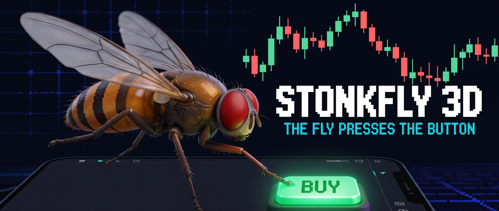
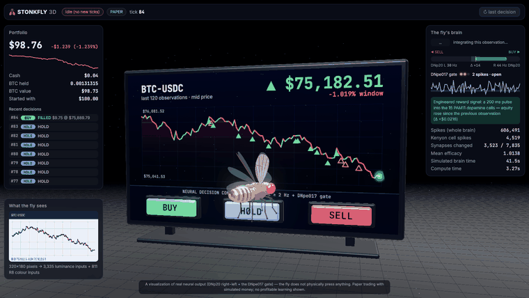
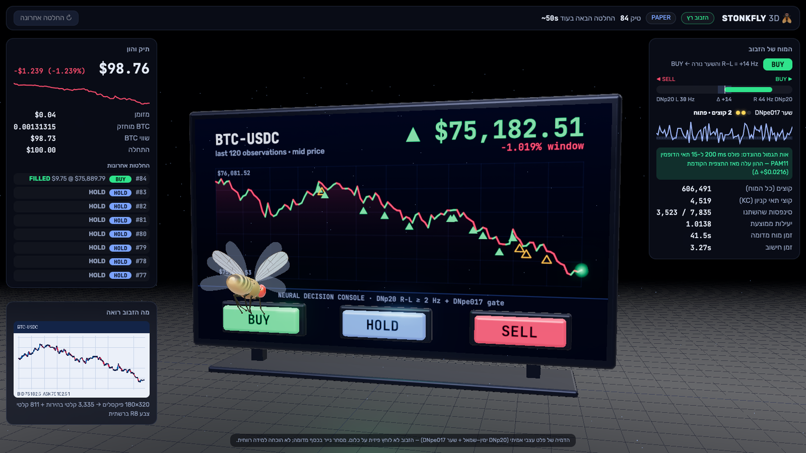
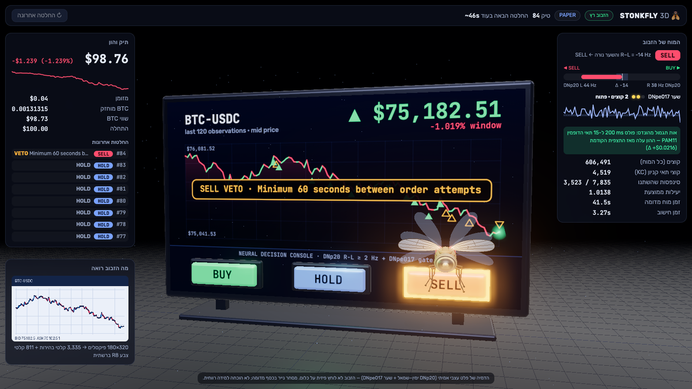

# Stonkfly 3D

A live 3D viewer for [Stonkfly](https://github.com/nftechie/stonkfly) — the experiment where a
simulated fruit-fly connectome (166,700 neurons, 25.6M connections) proposes crypto trades.

Stonkfly is headless: it writes JSON lines to a run directory. This fork adds `viewer/`, a
read-only window into that directory, so you can **watch** the fly decide instead of reading its
log. Every tick, the fly flies to the button its own neurons chose and presses it.



Nothing here changes how the fly trades. The viewer only reads.

## Quick start

```sh
python3.11 -m venv .venv
source .venv/bin/activate
pip install -e '.[test]'
python -m stonkfly prepare      # ~1.1 GB download, builds the graph
python -m viewer                # starts the fly + viewer, opens the browser
```

That is the whole thing: `python -m viewer` starts a **paper** worker (simulated $100, real public
BTC-USDC prices), serves the viewer on `http://127.0.0.1:8765` and opens it. Ctrl-C stops both and
preserves the fly's brain state; the same command resumes.

| Flag | Effect |
| --- | --- |
| `--out runs/paper` | which run directory to watch |
| `--port 8765` | first port to try |
| `--no-worker` | attach to a fly that is already running, or inspect a finished run |
| `--no-browser` | don't open a browser |

The viewer never starts live trading. A run directory whose ledger says `live`, a `STOP` file or a
halted run gets the viewer only, and the worker is left alone.

## What you are looking at



**The screen** shows what the fly actually sees — the same price chart that is rendered into its
retina — plus the trades it has made. Green triangles are filled buys, red are sells, hollow orange
are vetoed attempts.

**The fly** acts out the decoded neural decision:

- **BUY / SELL** — it flies to that button, reaches out its front legs and presses. The cap sinks in
  and glows.
- **FILLED** — the button flares and the fill appears on the screen.
- **VETO** — the button blinks orange, the reason appears, and the fly shakes its head and backs off.
- **HOLD** — it stays at its perch and grooms its front legs while the HOLD button hums.



**The brain panel** explains *why*. The decision is a tug-of-war between the left and right DNp20
descending neurons, gated by DNpe017:

| Neural measurement | Proposal |
| --- | --- |
| right − left ≥ 2 Hz, with at least one DNpe017 spike | BUY |
| right − left ≤ −2 Hz, with at least one DNpe017 spike | SELL |
| otherwise | HOLD |

The panel also shows the dopamine stimulus for that tick (15 PAM11 cells for positive P&L, 2 PPL101
cells for negative), total and Kenyon-cell spikes, and how many of the 7,835 plastic KC→MBON
synapses changed.

**The portfolio panel** tracks equity against the starting $100, cash, holdings and the last eight
decisions.

## How it fits together

```
stonkfly run ──writes──▶ runs/paper/{events.jsonl, latest.json, latest-input.png, ledger.sqlite}
                                   │  read-only
viewer/server.py ──────────────────┘
   GET /api/state?since=N   new ticks, portfolio, price history, status
   GET /api/input.png       the frame the fly last saw
                                   │  polled every 2 s
viewer/static/js/*.js ◀────────────┘   Three.js scene, fly rig, chart texture, panels
```

Design constraints worth knowing if you hack on it:

- **The viewer lives outside the `stonkfly/` package on purpose.** The worker hashes every `.py` and
  `.cpp` file in that package into its run provenance and refuses to resume a run if anything
  changed. Viewer code must never invalidate a run.
- **It is strictly read-only.** It never writes to the run directory and never takes the worker's
  lock. The ledger is opened with `mode=ro` (and `immutable=1` when no WAL file is present, so a
  read cannot even create one), and `events.jsonl` is tailed incrementally — a 20k-line file costs
  about 0.3 ms per poll instead of re-parsing 24 MB.
- **No build step, no npm.** Plain ES modules; Three.js loads from a CDN via an import map.
- **The fly is procedural.** Body, wings, eyes and the six three-jointed legs are built in code
  ([`viewer/static/js/fly.js`](viewer/static/js/fly.js)) — no model files, no textures to ship.

Tests: `python -m pytest -q` (the viewer's own are in `tests/test_viewer.py`).

## Honesty

This is a visualization, and the things it visualizes are real neural output — but nothing more
than that:

- **The fly does not press anything.** The press is how the viewer draws a decoded spike-rate
  difference. There is no body, no muscles and no motor control in the model.
- **Paper trading is the default.** Simulated money, real public prices. Live trading needs your own
  credentials, an explicit opt-in and the upstream instructions in
  [docs/operations.md](docs/operations.md).
- **No profitable learning has been demonstrated**, by upstream or here. See
  [docs/model.md](docs/model.md) and [docs/validation.md](docs/validation.md) for what is and is not
  established, including what it would take to claim otherwise.
- The reward and punishment signals are engineered current injections into identified dopamine
  cells. They are not pain, pleasure or anything the fly experiences.

The UI text is in Hebrew. The chart, buttons and neuron names on the 3D screen are in English.

## Credits

All the science, the connectome import, the neural kernel and the trading loop are
[nftechie/stonkfly](https://github.com/nftechie/stonkfly). This fork adds the viewer.

The connectome is the [MaleCNS v1.0 release](https://male-cns.janelia.org/download/); see
[THIRD_PARTY.md](THIRD_PARTY.md) for upstream data licensing. MIT licensed, as upstream.

> The original project README is kept at [docs/upstream-readme.md](docs/upstream-readme.md).
